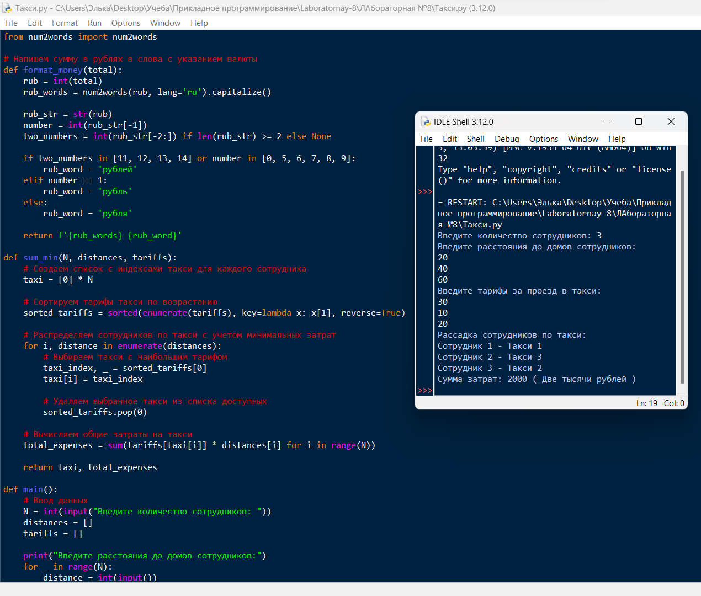
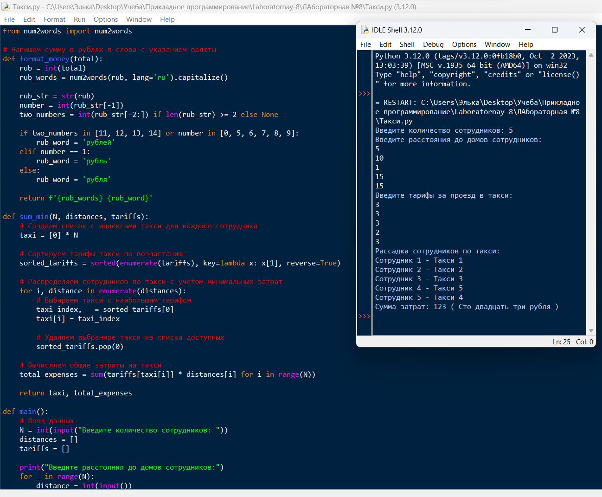
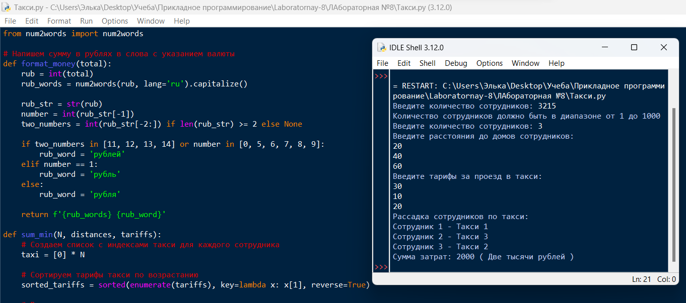

# Лабораторная №8

# Исполнитель
Громова Эльвира  
Группа ФТ-220007

# Задание
Написать программу: Такси.   
Директор фирмы решил заказать такси, чтобы развезти сотрудников по домам. Он заказал N машин — ровно столько, сколь у него сотрудников. У каждого водителя такси свой тариф за 1 километр. Директор знает, какому сотруднику сколько километров от работы до дома. Директор хочет определить, какой из сотрудников на каком такси должен поехать домой, чтобы суммарные затраты на такси были минимальны.  

Формат входных данных:  
Натуральное число N (1 ≤ N ≤ 1000) — количество сотрудников компании.  
Далее N чисел, задающих расстояния в километрах (положительные целые числа) от работы до домов сотрудников компании (первое число — для 1-го сотрудника, второе — для 2-го и т.д.).
Далее еще N чисел — тарифы в рублях (положительные целые числа) за проезд одного километра в такси (первое число — в 1-ой машине такси, второе — во 2-ой и т.д.).

Формат выходных данных:  
Выводится N чисел. Первое число — номер такси, в которое должен сесть 1-ый сотрудник, второе число — номер такси, в которое должен сесть 2-ой и т.д., чтобы суммарные затраты на такси были минимальны. Если вариантов рассадки сотрудников, при которых затраты минимальны, несколько, выведите любой из них.  
Сумма в рублях, которую необходимо заплатить за просчитанный вариант (цифрами).
Сумма словами в рублях с указанием валюты в правильном падеже.

# Среда разработки
Язык программирования: Python  
Среда разработки: IDLE

# Инструкция по работе
При открытии файла Такси.py необходимо ввести количество сотрудников, расстояние до домов и тарифы за проезд.

Запустить программу, нажав ENTER. При выводе Вы увидите рассадку сотрудников и минимальную сумму.

# Тесты
Выполнение программы  

Тест №1

Тест №2

Тест №3 (Проверка ошибки для ввода количества сотрудников)

